# RealTime_PAAO

## Installation Instruction

1. Download and unzip [RealtimePAAO.zip](https://github.com/LZP-2020-1-0200/RealTime_PAAO/releases/latest/download/RealtimePAAO.zip)

2. For Real-time fitting edit `config.json`with proper values, otherwise skip this step

3. Launch `RealTimePAAO.exe` and choose Real-time fitting or Post-factum fitting

## Usage Instruction

### Real-Time fitting

1. Edit `config.json`
   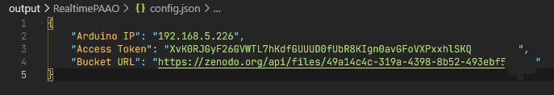

2. Choose **RealTime PAAO**
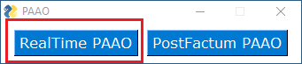

3. If `config.json` is edited correctly, then the graphical interface will appear without errors.
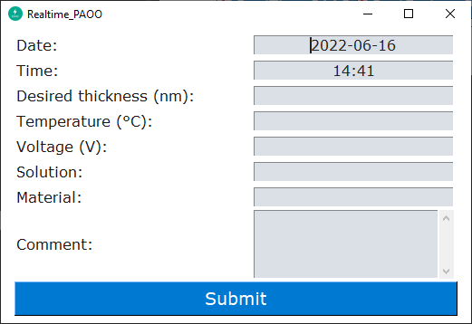

4. Fill fields with information about the sample and press *Submit*. After pressing *Submit* new folder will be created on the desktop.
**Important:** Do not use special characters, in these fields, such as ":" "/" " " etc.
**Important:** If folder is opened, close it before proceeding, otherwise it will lead to errors in further steps
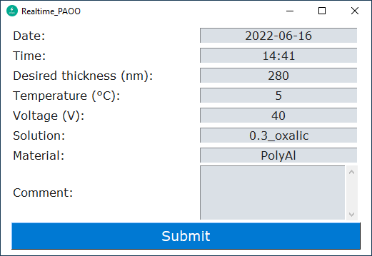
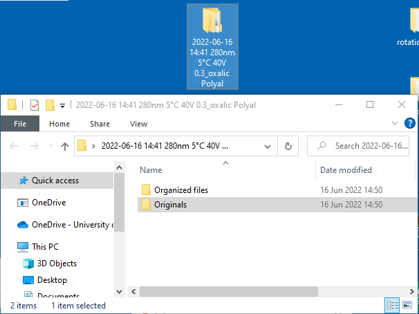

5. Using SpectraSuite software create a reference spectrum with the name `ref_spektrs.txt`as tab-delimited with headers. Copy this file to `Originals`
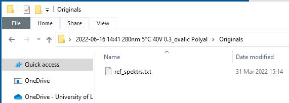

6. Press button *Check for reference spectrum*, if the reference spectrum is found in `Originals` folder, then a green tick appears, otherwise red cross appears
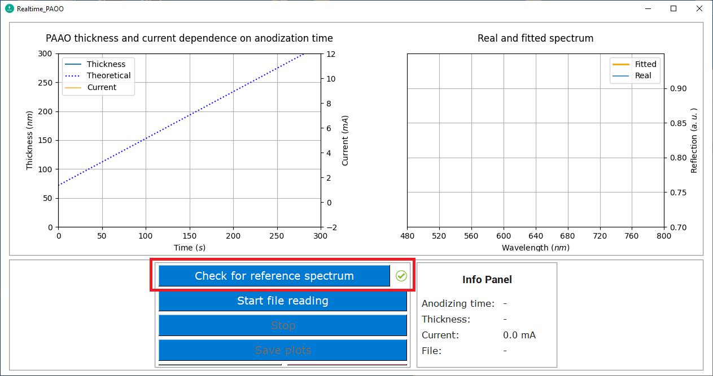

7. Press button *Start file reading*, to begin listening to new files in `Originals` folder
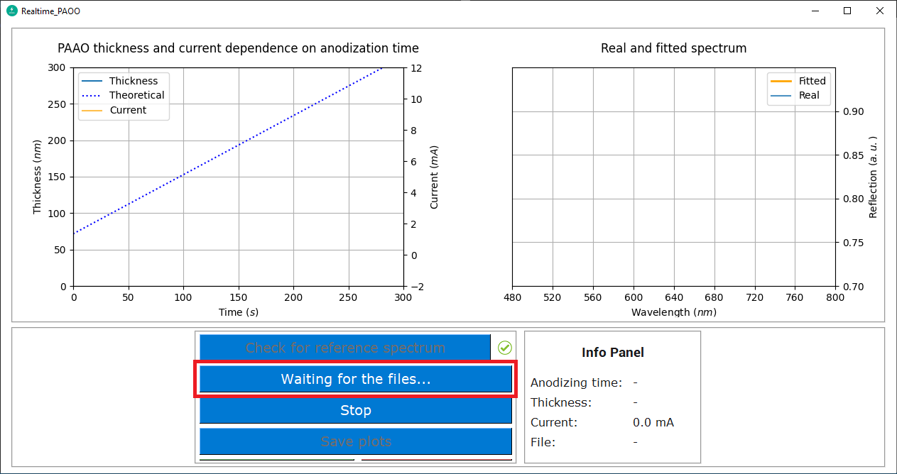

8. Using SpectraSuite software choose File->Save->Save Spectrum
   a) Save options: **Wait at least 200 ms** (no less than 200 ms)
   b) File Type: **Tab Delimited**
   c) Save to Directory: **`path/to/Originals`**
   d) Base Filename: **R**
   e) Padding digits: **5**
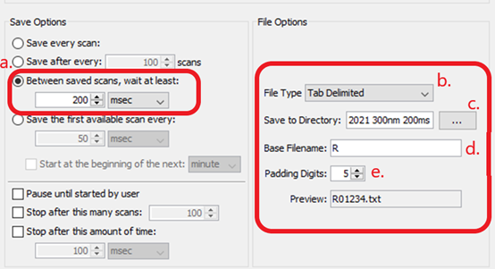

9. In SpectraSuite start spectra reading and saving

10. After checking that the spectra are being read, press *Power On* to start the anodizing process.
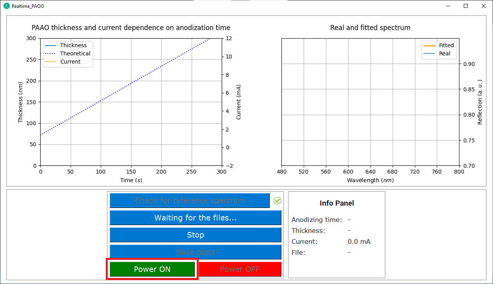

11. When desired thickness is reached power will turn off automatically. In SpectraSuite software disable spectra reading and saving, and then press *Stop* button.
**Important:** The order is very important! Firstly disable spectra saving in SpectraSuite then press *Stop* button

12. After pressing *Stop* button, the program will take some time to reorganize files. After reorganizing is complete, press *Save plots* button to save all plots and data.

13. After final reorganizing the `Organized files` will contain a similar view, where:
    1. `Pre anodizing spectrum`: All spectra that were taken before anodization
    2. `Anodizing spectrum`: All spectra that were taken during anodization
    3. `Post anodizing spectrum`: All spectra that were taken, after anodization
    4. `Anodizing plots`: All experimental spectra and fitted spectra plots
    5. `Anodizing Data`: All experimental spectra and fitted spectra data
   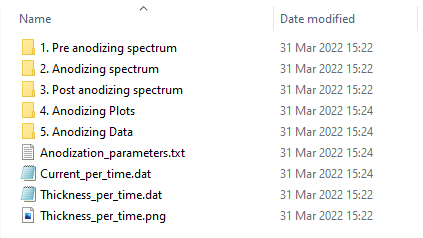

14. If all previous steps are done correctly, then after saving all plots, zipping process will proceed.
**Note:** This process might appear stuck if folder was opened before zipping started. In this, a case close the program and archive it and upload it to Zenodo manually

15. After zipping process is finished, automatic uploading to Zenodo repository will begin
**Note:** Only if the access token and bucket URL in `config.json` file are correct.

### Post-Factum fitting

1. Choose **PostFactum PAAO**
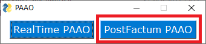

2. Press *Check for reference spectrum* button, and choose folder that contains `ref_spektrs.txt` and anodizing spectras e.g. `R000001.txt, R000002.txt ...`
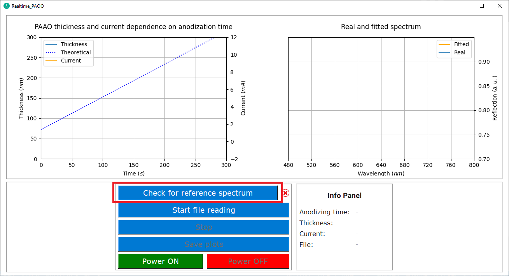

3. Press *Start file reading* button to start

4. After all files have been processed, press *Stop* button to stop fitting process and reorganize files.

5. After reorganization press *Save plots* to save all plots and data
